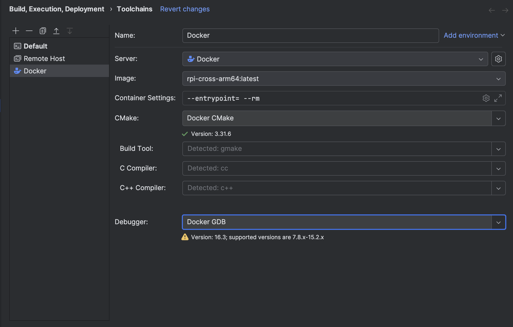
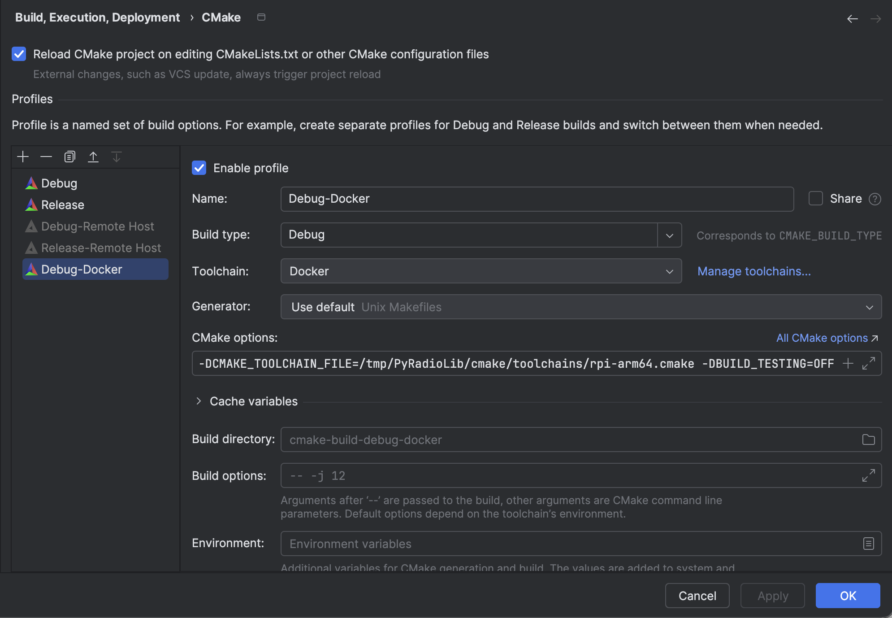

# Кросс-компиляция под Raspberry Pi (aarch64) в Docker и CLion

Этот документ описывает полностью рабочий процесс кросс-компиляции проекта под
Raspberry Pi (64-битная Raspberry Pi OS) с использованием:

- **sysroot**, полученного с живой Raspberry Pi через `rsync`;
- **Docker-образа** с установленным кросс-компилятором `aarch64-linux-gnu-*`;
- **CLion**, который запускает сборку внутри Docker-контейнера.

---

## 1. Общая схема

1. На **самой Raspberry Pi** устанавливаются все необходимые пакеты, dev-библиотеки
   и заголовки.
2. На **хост-машине** (где есть Docker) с помощью `rsync` копируется часть файловой
   системы Raspberry Pi в локальный каталог `rpi-sysroot/` — это и есть *sysroot*.
3. Собирается **Docker-образ**, внутри которого sysroot помещается в `/opt/rpi-sysroot`.
4. Внутри контейнера используется кросс-компилятор `aarch64-linux-gnu-*` и CMake
   с `CMAKE_SYSROOT=/opt/rpi-sysroot`.
5. CLion подключается к этому образу как к **toolchain** и собирает проект напрямую
   внутри Docker-контейнера.

---

## 2. Требования

### На Raspberry Pi

- Raspberry Pi OS (64-битная).
- Доступ по SSH с хост-машины.

### На хост-машине

- Docker / Docker Desktop.
- Git / CMake (как минимум для локальной работы).
- (Опционально) CLion для интеграции с IDE.

---

## 3. Подготовка Raspberry Pi

> Все команды в этом разделе выполняются **на Raspberry Pi**, а не в Docker.

Установите необходимые пакеты:

```bash
sudo apt update
sudo apt install -y \
    cmake i2c-tools gcc g++ \
    liblgpio1 liblgpio-dev python3-lgpio python3-rpi.gpio \
    libgpiod-dev build-essential \
    pkg-config python3 python3-full \
    python3-smbus python3-dev gpiod \
    linux-headers-6.12.47+rpt-rpi-v8
````

Кратко, зачем это нужно:

* `cmake`, `pkg-config`, `build-essential`, `gcc`, `g++` — стандартный набор инструментов сборки.
* `liblgpio*`, `python3-lgpio`, `python3-rpi.gpio`, `libgpiod-dev`, `gpiod`,
  `python3-smbus` — всё, что нужно для работы с GPIO/I²C из C/C++ и Python.
* `python3`, `python3-full`, `python3-dev` — интерпретатор и dev-заголовки Python.
* `linux-headers-*` — заголовки ядра (важно, чтобы версия совпадала с `uname -r`).

При дальнейшей синхронизации эти библиотеки и заголовки попадут в sysroot и будут
доступны кросс-компилятору.

---

## 4. Структура проекта на хост-машине

На хосте создайте базовую структуру (путь можно выбрать произвольно):

```bash
mkdir -p ~/rpi-cross
cd ~/rpi-cross

mkdir -p rpi-sysroot
touch Dockerfile rsync.sh
```

Итоговая структура для кросс-сборки:

```text
rpi-cross/
├── Dockerfile                    # описание Docker-образа
├── rsync.sh                      # скрипт синхронизации sysroot и сборки образа
└── rpi-sysroot/                  # сюда будет копироваться sysroot с Raspberry Pi
```

Далее предполагается, что ваш **основной проект** лежит отдельно (например, в
`~/projects/PyRadioLib`), а этот каталог используется как база для образа.
При желании кросс-инфраструктуру можно хранить прямо в репозитории проекта — логика от этого не меняется.

---

## 5. Скрипт обновления sysroot и сборки Docker-образа

Файл `rsync.sh`:

```bash
#!/usr/bin/env bash
set -euo pipefail

# Логин и адрес вашей Raspberry Pi.
# Пример: RPI_HOST=pi@192.168.88.42
export RPI_HOST=login@address

# Базовый каталог для sysroot (локальный, на хост-машине)
SYSROOT_DIR="./rpi-sysroot"

# Создаём каталог, если его ещё нет
mkdir -p "${SYSROOT_DIR}"

echo "=== Синхронизация sysroot с ${RPI_HOST} ==="

# Копируем системные каталоги с RPi в локальный sysroot.
# --delete гарантирует, что локальная копия соответствует устройству.
rsync -avz --delete "${RPI_HOST}:/lib"         "${SYSROOT_DIR}/lib"
rsync -avz --delete "${RPI_HOST}:/usr/bin"     "${SYSROOT_DIR}/usr/bin"
rsync -avz --delete "${RPI_HOST}:/usr/include" "${SYSROOT_DIR}/usr/include"
rsync -avz --delete "${RPI_HOST}:/usr/lib"     "${SYSROOT_DIR}/usr/lib"
rsync -avz --delete "${RPI_HOST}:/usr/libexec" "${SYSROOT_DIR}/usr/libexec"
rsync -avz --delete "${RPI_HOST}:/usr/sbin"    "${SYSROOT_DIR}/usr/sbin"
rsync -avz --delete "${RPI_HOST}:/usr/src"     "${SYSROOT_DIR}/usr/src"
rsync -avz --delete "${RPI_HOST}:/usr/local"   "${SYSROOT_DIR}/usr/local"

echo "=== Сборка Docker-образа rpi-cross-arm64 ==="

docker build . \
    -t rpi-cross-arm64:latest \
    -t rpi-cross-arm64:version

echo "Готово."
```

Сделайте скрипт исполняемым и запустите:

```bash
chmod +x rsync.sh
./rsync.sh
```

После завершения у вас:

* актуальный sysroot в `./rpi-sysroot`;
* собран Docker-образ `rpi-cross-arm64:latest`.

Повторяйте запуск скрипта после обновления пакетов или ядра на Raspberry Pi.

---

## 6. Dockerfile

Файл `Dockerfile`:

```dockerfile
# Базовый образ
FROM debian:trixie

# Устанавливаем инструменты для сборки и кросс-компилятор под aarch64
RUN apt-get update && apt-get install -y \
        cmake ninja-build make pkg-config \
        gcc-aarch64-linux-gnu g++-aarch64-linux-gnu \
        rsync python3 git build-essential gdb \
    && rm -rf /var/lib/apt/lists/*

# Папка, куда будет помещён sysroot Raspberry Pi внутри контейнера
RUN mkdir -p /opt/rpi-sysroot

# Копируем подготовленный на хосте sysroot внутрь образа
COPY ./rpi-sysroot/ /opt/rpi-sysroot

# Рабочий каталог по умолчанию
WORKDIR /workspace
```

При необходимости сюда можно добавить дополнительные пакеты (например, `python3-pip`
и модули для генерации stub-файлов).

---

## 7. Toolchain-файл CMake

Файл `cmake/toolchains/rpi-arm64.cmake`:

```cmake
# cmake/toolchains/rpi-arm64.cmake

# Целевая система
set(CMAKE_SYSTEM_NAME Linux)
set(CMAKE_SYSTEM_PROCESSOR aarch64)

# Кросс-компиляторы
set(CMAKE_C_COMPILER   aarch64-linux-gnu-gcc)
set(CMAKE_CXX_COMPILER aarch64-linux-gnu-g++)

# Sysroot внутри контейнера
set(RPI_SYSROOT "/opt/rpi-sysroot")
set(CMAKE_SYSROOT "${RPI_SYSROOT}")

# CMake должен всё искать внутри sysroot
set(CMAKE_FIND_ROOT_PATH "${RPI_SYSROOT}")

set(CMAKE_FIND_ROOT_PATH_MODE_PROGRAM NEVER)
set(CMAKE_FIND_ROOT_PATH_MODE_LIBRARY ONLY)
set(CMAKE_FIND_ROOT_PATH_MODE_INCLUDE ONLY)
set(CMAKE_FIND_ROOT_PATH_MODE_PACKAGE ONLY)

# Настройки для pkg-config
set(ENV{PKG_CONFIG_SYSROOT_DIR} "${RPI_SYSROOT}")
set(ENV{PKG_CONFIG_LIBDIR} "${RPI_SYSROOT}/usr/lib/aarch64-linux-gnu/pkgconfig:${RPI_SYSROOT}/usr/share/pkgconfig")

set(Python3_ROOT_DIR "${CMAKE_SYSROOT}/usr" CACHE PATH "Python3 root in sysroot")
set(Python3_INCLUDE_DIR "${CMAKE_SYSROOT}/usr/include/python3.13" CACHE PATH "")
set(Python3_LIBRARY     "${CMAKE_SYSROOT}/usr/lib/aarch64-linux-gnu/libpython3.13.so" CACHE FILEPATH "")

set(IS_CROSSCOMPILING ON)
```

Важно: `CMAKE_TOOLCHAIN_FILE` в вызове CMake должен указывать **на этот файл**, а не
на директорию sysroot. Путь к sysroot уже зашит внутрь.

---

## 8. Ручной запуск контейнера (без CLion)

Для проверки можно вручную запустить контейнер и собрать проект:

```bash
# На хосте, в корне вашего проекта
docker run --rm -it \
    -v "$PWD":/workspace \
    rpi-cross-arm64:latest \
    /bin/bash
```

Внутри контейнера:

```bash
mkdir -p build
cd build

cmake .. \
  -G Ninja \
  -DCMAKE_TOOLCHAIN_FILE=/workspace/cmake/toolchains/rpi-arm64.cmake

cmake --build . -j$(nproc)
```

Полученные бинарники будут предназначены для Raspberry Pi (aarch64).

---

## 9. Интеграция с CLion

### 9.1. Общая идея

CLion сам:

* запускает Docker-контейнер из образа `rpi-cross-arm64:latest`;
* монтирует в контейнер проект (обычно в `/tmp/<ИмяПроекта>`);
* выполняет `cmake` и сборку внутри контейнера с указанным `CMAKE_TOOLCHAIN_FILE`.

Вам нужно:

1. Создать Docker-toolchain.
2. Создать CMake-профиль, который:

    * использует этот toolchain;
    * передаёт `-DCMAKE_TOOLCHAIN_FILE=...` с путём к `rpi-arm64.cmake`
      **внутри контейнера**.

---

### 9.2. Настройка Docker-toolchain в CLion

Откройте:

> **Settings → Build, Execution, Deployment → Toolchains**

1. Нажмите `+` и выберите **Docker**.

2. Задайте имя, например: **`Docker`**.

3. В поле **Server** выберите ваш Docker-демон (`Docker`).

4. В поле **Image** укажите:

```text
rpi-cross-arm64:latest
```

5. В поле **Container Settings** укажите:

```text
--rm
```

   (контейнер будет автоматически удалён после завершения сборки).

6. В поле **CMake** выберите **Docker CMake**.

7. Убедитесь, что CLion успешно определил `Build Tool`, `C Compiler`, `C++ Compiler`
   внутри контейнера (появится статус **Detected**).

Скриншот (пример):



> Примечание: CLion может показать предупреждение о версии GDB
> («Version 16.3; supported versions are 7.8.x–15.2.x»). Для чистой сборки
> это не критично. Для отладки можно установить в образ другую версию `gdb`
> или явно указать альтернативный debugger.

---

### 9.3. Настройка CMake-профиля

Откройте:

> **Settings → Build, Execution, Deployment → CMake**

1. Нажмите `+` и создайте новый профиль, например **`Debug-Docker`**.

2. Поставьте галочку **Enable profile**.

3. В поле **Build type** выберите `Debug`.

4. В поле **Toolchain** выберите созданный ранее `Docker`.

5. В поле **Generator** оставьте «Use default Unix Makefiles» или выберите `Ninja`
   (если используете Ninja внутри образа).

6. В поле **Build directory** задайте, например:

```text
cmake-build-debug-docker
```

7. В поле **CMake options** укажите:

```text
-DCMAKE_TOOLCHAIN_FILE=/tmp/PROJECT_NAME/cmake/toolchains/rpi-arm64.cmake -DBUILD_TESTING=OFF
```

   Где:
    * `/tmp/PROJECT_NAME` — путь, под которым CLion монтирует проект в контейнер.
      Его можно посмотреть в логах CMake/консоли CLion (на скриншоте это, например,
      `/tmp/PyRadioLib`).
    * `cmake/toolchains/rpi-arm64.cmake` — путь к toolchain-файлу относительно
      корня проекта.

Скриншот (пример):


---

### 9.4. Сборка проекта из CLion

После настройки:

1. Выберите профиль конфигурации, основанный на `Debug-Docker`.
2. Нажмите **Reload CMake Project**, если это не сделано автоматически.
3. Выполните **Build** или **Rebuild**.

CLion:

* поднимет контейнер из образа `rpi-cross-arm64:latest`;
* смонтирует в него проект;
* запустит CMake с указанным `CMAKE_TOOLCHAIN_FILE`;
* соберёт проект кросс-компиляторами `aarch64-linux-gnu-*` с использованием
  sysroot `/opt/rpi-sysroot`.

Результат — исполняемые файлы и библиотеки для Raspberry Pi (aarch64),
которые можно перенести на плату и запускать там.

